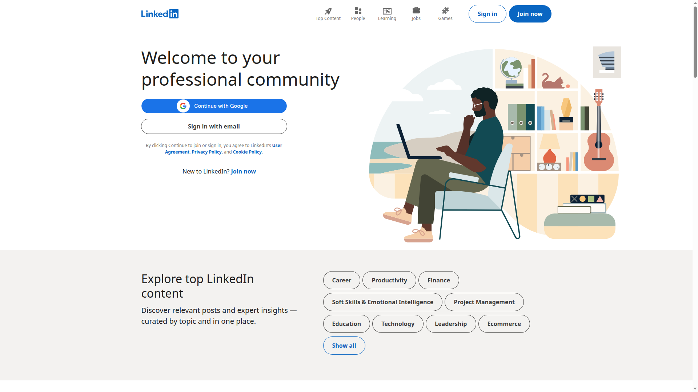
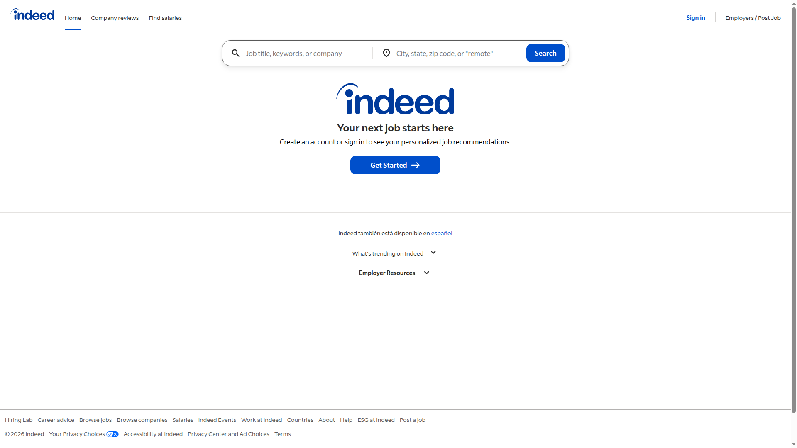
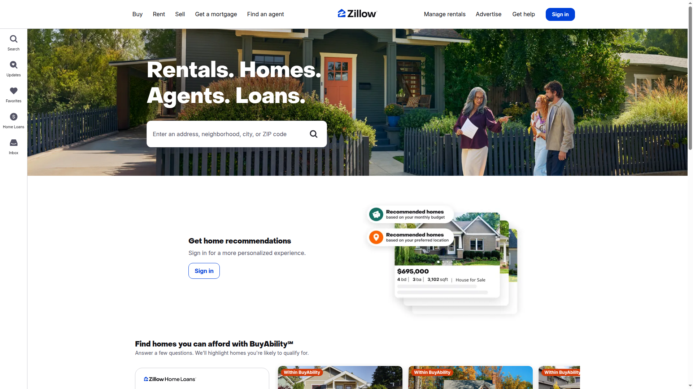
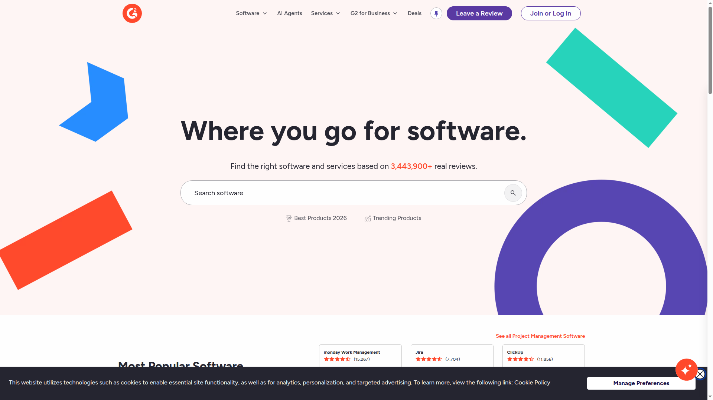

# BrowserPilot

> Ever wished you could tell your browser "Hey, go grab all the product prices from that e-commerce site" and it would just... do it? That's exactly what this does, but smarter.

[](https://opensource.org/licenses/MIT)
[](https://www.python.org/downloads/)
[](https://github.com/ai-naymul/BrowserPilot/actions/workflows/tests.yml)
[](http://makeapullrequest.com)

## What's This All About?

Tired of writing complex scrapers that break every time a website changes its layout? Yeah, me too. 

This AI-powered browser actually *sees* web pages like you do. It doesn't care if Amazon redesigns their product pages or if LinkedIn adds new anti-bot measures. Just tell it what you want in plain English, and it figures out how to get it.

Think of it as having a really smart intern who never gets tired, never makes mistakes, and can handle any website you throw at them - even the ones with annoying CAPTCHAs.

## See It In Action

Trust me, it's pretty cool watching an AI navigate websites like a human


https://github.com/user-attachments/assets/39d2ed68-e121-49b9-817e-2eb5edc25627


## Ghost Mode — Production-Grade Stealth

BrowserPilot's stealth engine passes the hardest bot detection benchmarks on the internet. No noise injection, no brittle hacks — real Chromium with patchright, real GPU fingerprints, human-like behavior.

### Benchmark Results

| Benchmark | Score | What It Tests |
|-----------|-------|---------------|
| [Sannysoft](https://bot.sannysoft.com/) | **All Green** | WebDriver, Chrome object, plugins, WebGL, permissions |
| [Pixelscan Bot Check](https://pixelscan.net/bot-check) | **4/4 Clear** | Navigator, WebDriver, CDP, User Agent |
| [Rebrowser Bot Detector](https://bot-detector.rebrowser.net/) | **9/10 Pass** | CDP leaks, runtime detection, init scripts, viewport |
| [BrowserScan](https://www.browserscan.net/bot-detection) | **All Normal** | Fingerprint + bot detection combined |
| [Incolumitas](https://bot.incolumitas.com/) | **All OK** | Puppeteer/Playwright detection, worker consistency |
| [CreepJS](https://abrahamjuliot.github.io/creepjs/) | **Real Fingerprint** | Deep fingerprint analysis, WebGL, canvas, audio |
| [IPhey](https://iphey.com/) | **5/6 Green** | Browser, location, IP, hardware, software checks |
| [DeviceAndBrowserInfo](https://deviceandbrowserinfo.com/are_you_a_bot) | **"You are human!"** | 20+ signals all false — CDP, WebDriver, headless |
| [BrowserLeaks WebRTC](https://browserleaks.com/webrtc) | **No IP Leak** | WebRTC local IP prevention |

<details>
<summary><b>Benchmark Screenshots (click to expand)</b></summary>

| Sannysoft — All Green | Pixelscan — 4/4 Clear | DeviceInfo — "You are human!" |
|---|---|---|
|  |  |  |

| Rebrowser — 9/10 Pass | BrowserScan — All Normal | BrowserLeaks — No IP Leak |
|---|---|---|
|  |  |  |

</details>

### Tier S Anti-Bot Bypass

We tested against the **hardest commercial anti-bot systems** — the ones that block 99% of automation tools. BrowserPilot loaded 11 out of 14 sites without blocks:

| Site | Anti-Bot System | Tier | Result |
|------|----------------|------|--------|
| **Foot Locker** | DataDome | S | **Loaded** — full homepage with products |
| **Leboncoin** | DataDome | S | **Loaded** — listings + cookie consent |
| **Vinted** | DataDome | S | **Loaded** — country selector served |
| **Nike** | Akamai | A | **Loaded** — location selector |
| **New Balance** | Akamai | A | **Loaded** — full homepage |
| **Zalando** | Akamai | A | **Loaded** — country page |
| **Wayfair** | PerimeterX | A | **Loaded** — full homepage |
| **Ticketmaster** | Multiple | A | **Loaded** — full homepage with events |
| **Stake.com** | Cloudflare Enterprise | A | **Loaded** — full site |
| **LinkedIn** | Cloudflare + custom | A | **Loaded** — login page served |
| **Booking.com** | DataDome + custom | S | **Loaded** — search functional |
| **Canada Goose** | Kasada | S | Partial — nav rendered, 429 on content |
| **Nowsecure.nl** | Cloudflare Turnstile | A | Challenge — Turnstile presented |
| **Hermes** | DataDome (strictest) | S | Blocked — IP-level restriction |

<details>
<summary><b>Tier S Screenshots (click to expand)</b></summary>

| Foot Locker (DataDome) | Leboncoin (DataDome) | Vinted (DataDome) |
|---|---|---|
|  |  |  |

| Nike (Akamai) | Wayfair (PerimeterX) | Ticketmaster |
|---|---|---|
|  |  |  |

| New Balance (Akamai) | Stake.com (CF Enterprise) | Booking.com |
|---|---|---|
|  |  |  |

</details>

### More Real-World Results

| Site | Protection | Result |
|------|-----------|--------|
| **Indeed** | PerimeterX | Loaded — full homepage |
| **Zillow** | Cloudflare | Loaded — listings visible |
| **G2** | Cloudflare | Loaded — full homepage |

<details>
<summary><b>Additional Screenshots (click to expand)</b></summary>

| LinkedIn | Indeed | Zillow |
|---|---|---|
|  |  |  |

| G2 |
|---|
|  |

</details>

### How It Works

- **Patchright** — Playwright fork that never calls `Runtime.enable` (defeats CDP detection)
- **Full Chromium via xvfb** — Real `window.chrome`, plugins, codecs, WebGL (not headless shell)
- **Vulkan GPU rendering** — Real WebGL fingerprint from actual hardware
- **Fingerprint diversification** — Seed-based profiles vary viewport, UA, DPR, locale per session
- **Human behavior** — Bezier mouse curves, variable typing speed, natural scroll patterns
- **Geo-matching** — Proxy country auto-maps to correct timezone + locale + languages
- **WebRTC prevention** — Local IP never leaked through WebRTC

> **Why no noise injection?** Anti-bots (Cloudflare, DataDome) detect JS canvas/WebGL noise by rendering known values and checking them. Real fingerprints from real hardware, varied through configuration, is the [Multilogin-validated approach](https://multilogin.com/).

---

## Bulk Scraping — Production Speed at Scale

Single-page demos are cute. Production scraping means hundreds of pages across protected sites without a single block. BrowserPilot's bulk engine does exactly that.

<p align="center">
  
</p>

### What You Get

| Feature | Details |
|---------|---------|
| **Concurrent workers** | Up to 10 parallel browsers, each with its own fingerprint |
| **Context rotation** | New identity (viewport, UA, locale) every N pages — no browser restart needed |
| **Resource blocking** | Blocks images, fonts, CSS for 3-5x faster page loads |
| **Adaptive throttling** | Auto backs off on 429s, speeds up on success |
| **Cookie persistence** | Cookies survive context rotation — sessions don't break |
| **Checkpoint/resume** | Crash mid-job? Resume from where you stopped |
| **DOM extraction** | Fast BeautifulSoup extraction by default (no AI API calls needed) |
| **Shared block intelligence** | If one worker gets blocked on a domain+proxy, all workers skip it |

### Quick Start

```bash
# API — scrape 10 URLs with 3 workers
curl -X POST http://localhost:8000/bulk \
  -H "Content-Type: application/json" \
  -d '{
    "urls": ["https://example.com/page1", "https://example.com/page2"],
    "prompt": "Extract product data",
    "format": "json",
    "max_workers": 3,
    "block_resources": true
  }'

# Check progress
curl http://localhost:8000/bulk/{job_id}

# Resume a crashed job
curl -X POST http://localhost:8000/bulk/{job_id}/resume
```

### Performance

| Test | Pages | Speed | Blocked |
|------|-------|-------|---------|
| Hacker News (15 pages) | 15/15 | **37.8 pages/min** | 0 |
| Mixed anti-bot (DataDome, Akamai, PerimeterX, Cloudflare) | 10/10 | **33.7 pages/min** | 0 |

---

## Why You'll Love This

### It Actually "Sees" Websites
- Uses Google's Gemini AI to look at pages like you do
- Automatically figures out if it's looking at Amazon, LinkedIn, or your random blog
- Clicks the right buttons even when websites change their design
- Works on literally any website (yes, even the weird ones)

### Handles the Annoying Stuff
- Gets blocked by Cloudflare? No problem, switches proxies automatically
- Encounters a CAPTCHA? Solves it with AI vision
- Website thinks it's a bot? Laughs in artificial intelligence
- Proxy goes down? Switches to a backup faster than you can blink

### Gives You Data How You Want It
- Say "save as PDF" and boom, you get a PDF
- Ask for CSV and it structures everything perfectly
- Want JSON? It knows what you mean
- Organizes everything with timestamps and metadata (because details matter)

### Watch It Work Live
- Stream the browser view in real-time (it's oddly satisfying)
- Click and type remotely if you need to step in
- Multiple people can watch the same session
- Perfect for debugging or just showing off

## Getting Started (It's Actually Pretty Easy)

### 🐳 Quick Start with Docker (Recommended)

The easiest way to run BrowserPilot is with Docker:

```bash
# Clone and start with Docker Compose
git clone https://github.com/ai-naymul/BrowserPilot.git
cd BrowserPilot
echo 'GOOGLE_API_KEY=your_actual_api_key_here' > .env
docker-compose up -d
```

Open `http://localhost:8000` and you're ready to go! 🚀

[📖 Full Docker Documentation](README.docker.md)

### 💻 Manual Installation

### What You'll Need
- Python 3.8 or newer (check with `python --version`)
- A Google AI API key (free to get, just sign up at ai.google.dev)
- Some proxies if you're planning to scrape heavily (optional but recommended)

### Let's Get This Running

1. **Grab the code**
   ```bash
   git clone https://github.com/ai-naymul/BrowserPilot.git
   cd BrowserPilot
   ```

2. **Install the good stuff**
   ```bash
   curl -LsSf https://astral.sh/uv/install.sh | sh
   uv pip install -r requirements.txt
   ```

3. **Add your secrets**
   ```bash
   # Create a .env file (don't worry, it's gitignored)
   echo 'GOOGLE_API_KEY=your_actual_api_key_here' > .env
   echo 'SCRAPER_PROXIES=[{"server": "http://proxy1:port", "username": "user", "password": "pass"}]' >> .env
   ```

4. **Fire it up**
   ```bash
   python -m uvicorn backend.main:app --reload
   ```

5. **See the magic**
   Open `http://localhost:8000` and start telling it what to do

## Real Examples (Because Everyone Loves Examples)

### Just Getting Started
```javascript
"Go to Hacker News and save the top stories as JSON"
```
That's it. Seriously. It'll figure out the rest.

### Shopping for Data
```javascript
"Search Amazon for wireless headphones under $100 and export the results to CSV"
```
It'll navigate, search, filter, and organize everything nicely for you.

### Social Media Intel
```javascript
"Go to LinkedIn, find AI engineers in San Francisco, and save their profiles"
```
Don't worry, it handles all the login prompts and infinite scroll nonsense.

### The Wild West
```javascript
"Visit this random e-commerce site and grab all the product prices"
```
Even works on sites you've never seen before. That's the beauty of AI vision.

## Core Components

### Smart Browser Controller
- Automatic anti-bot detection using AI vision
- Proxy rotation on detection/blocking
- CAPTCHA solving capabilities
- Browser restart with new proxies

### Vision Model Integration
- Dynamic website analysis
- Anti-bot system detection
- Element interaction decisions
- CAPTCHA recognition and solving

### Universal Extractor
- AI-powered content extraction
- Multiple output format support
- Structured data organization
- Metadata preservation

### Proxy Management
- Health tracking and statistics
- Performance-based selection
- Site-specific blocking lists
- Automatic failure recovery

## The Cool Technical Stuff

### Smart Format Detection
Just talk to it naturally:
- "save as PDF" → Gets you a beautiful PDF
- "export to CSV" → Perfectly structured spreadsheet
- "give me JSON" → Clean, organized data structure

### Anti-Bot Ninja Mode
- Spots Cloudflare challenges before they even load
- Solves CAPTCHAs like a human (but faster)
- Detects rate limits and backs off gracefully
- Switches identities when websites get suspicious

### Dashboard That Actually Helps
- See which proxies are working (and which ones suck)
- Watch your browser sessions live
- Track how much you're spending on AI tokens
- Performance stats that make sense

## Configuration

### Proxy Configuration
```json
{
  "SCRAPER_PROXIES": [
    {
      "server": "http://proxy1.example.com:8080",
      "username": "user1",
      "password": "pass1",
      "location": "US"
    },
    {
      "server": "http://proxy2.example.com:8080",
      "username": "user2",
      "password": "pass2",
      "location": "EU"
    }
  ]
}
```

### Environment Variables
```bash
# Required
GOOGLE_API_KEY=your_gemini_api_key_here

# Optional
SCRAPER_PROXIES=your_proxy_configuration
```

## Contributors

<a href="https://github.com/your-username/your-repo/graphs/contributors">
  
</a>


## 🤝 Want to Help Make This Better?

Found a bug? Have a crazy idea? Want to add support for your favorite website? I'd love the help!

Here's how to jump in:
1. Fork this repo (there's a button for that)
2. Create a branch with a name that makes sense (`git checkout -b fix-amazon-pagination`)
3. Make your changes (and please test them!)
4. Commit with a message that explains what you did
5. Push it up and open a pull request

For big changes, maybe open an issue first so we can chat about it.

## 🙏 Acknowledgments

- [Patchright](https://github.com/nicecatchpro/patchright) for undetected browser automation
- [Playwright](https://playwright.dev/) for the browser automation foundation
- [Google Gemini](https://ai.google.dev/) for vision AI capabilities
- [FastAPI](https://fastapi.tiangolo.com/) for the backend framework
- Open source community for inspiration and tools
