# BrowserPilot

**Tell a browser what you want in plain English. It scrapes any website — even the ones that block everyone else.**

[](https://opensource.org/licenses/MIT)
[](https://www.python.org/downloads/)
[](https://github.com/ai-naymul/BrowserPilot/actions/workflows/tests.yml)
[](http://makeapullrequest.com)

<p align="center">
  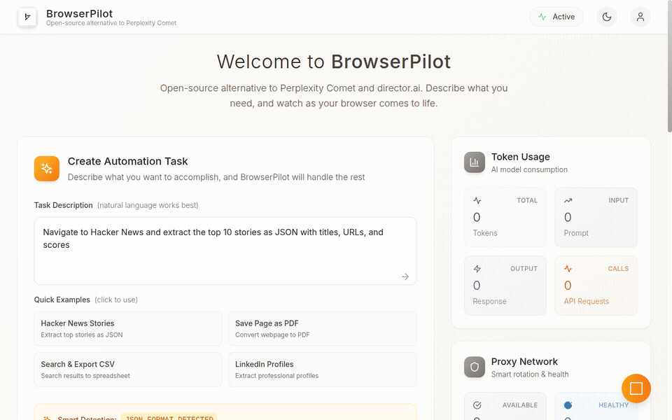
  <br>
  <em>Type what you want → AI navigates any website → get structured data back.</em>
</p>

---

## Why BrowserPilot?

Most scraping tools break the moment a site has Cloudflare, DataDome, or Akamai. BrowserPilot doesn't.

| | BrowserPilot | Playwright | Selenium | Browserbase | Scrapy |
|---|---|---|---|---|---|
| Bypasses DataDome/Akamai | **Yes** | No | No | Partial | No |
| AI vision (works on any site) | **Yes** | No | No | No | No |
| Bulk scraping with stealth | **Yes** | No | No | Yes ($$$) | Yes (no JS) |
| Self-hosted & free | **Yes** | Yes | Yes | No ($30/mo) | Yes |
| Human-like behavior | **Yes** | No | No | No | N/A |
| Pixelscan score | **105/105** | ~60/105 | ~40/105 | Unknown | N/A |

---

## What You Can Do

```python
# Single page — just describe what you want
"Go to Amazon and extract all laptop prices under $1000 as JSON"

# Bulk scrape — hit hundreds of pages across protected sites
curl -X POST http://localhost:8000/bulk -H "Content-Type: application/json" -d '{
  "urls": ["https://nike.com", "https://wayfair.com", "https://footlocker.com"],
  "prompt": "Extract product data",
  "format": "json",
  "max_workers": 3
}'

# Watch it work — live browser stream in your browser
# Open http://localhost:8000 and watch the AI navigate in real-time
```

**Output formats:** JSON, CSV, PDF, HTML, Markdown, plain text — just ask.

---

## Stealth That Actually Works

We don't just claim stealth — we prove it. BrowserPilot passes every major bot detection benchmark:

| Benchmark | Score |
|-----------|-------|
| [Pixelscan](https://pixelscan.net/) | **105/105 Clear** |
| [Sannysoft](https://bot.sannysoft.com/) | **29/29 Passed** |
| [Rebrowser](https://bot-detector.rebrowser.net/) | **9/10 Pass** |
| [BrowserScan](https://www.browserscan.net/) | **All Normal** |
| [DeviceAndBrowserInfo](https://deviceandbrowserinfo.com/) | **"You are human!"** |
| [BrowserLeaks WebRTC](https://browserleaks.com/webrtc) | **No IP Leak** |

<details>
<summary><b>See benchmark screenshots</b></summary>

| Sannysoft | Pixelscan | DeviceInfo |
|---|---|---|
| 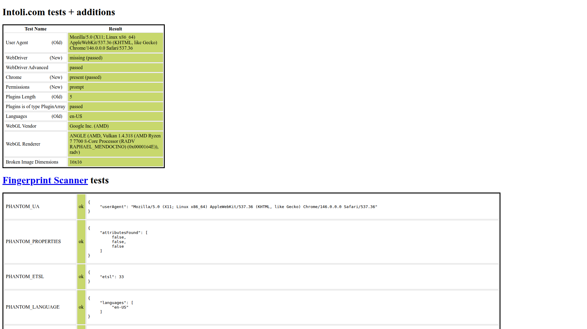 | 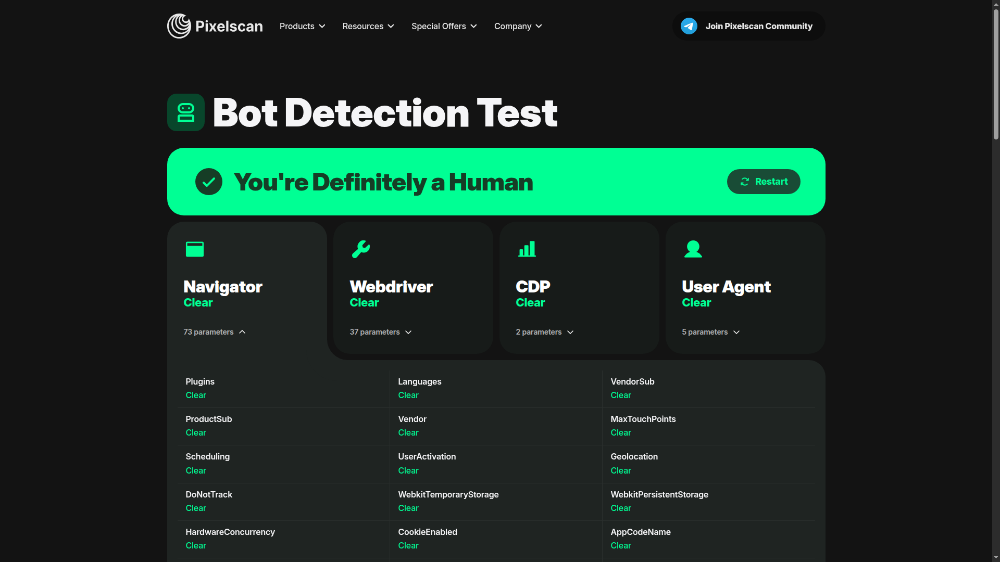 | 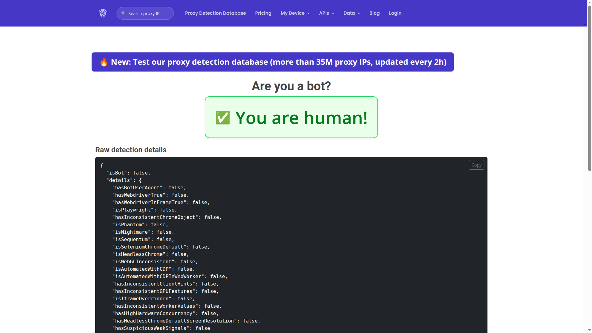 |

| Rebrowser | BrowserScan | BrowserLeaks |
|---|---|---|
| 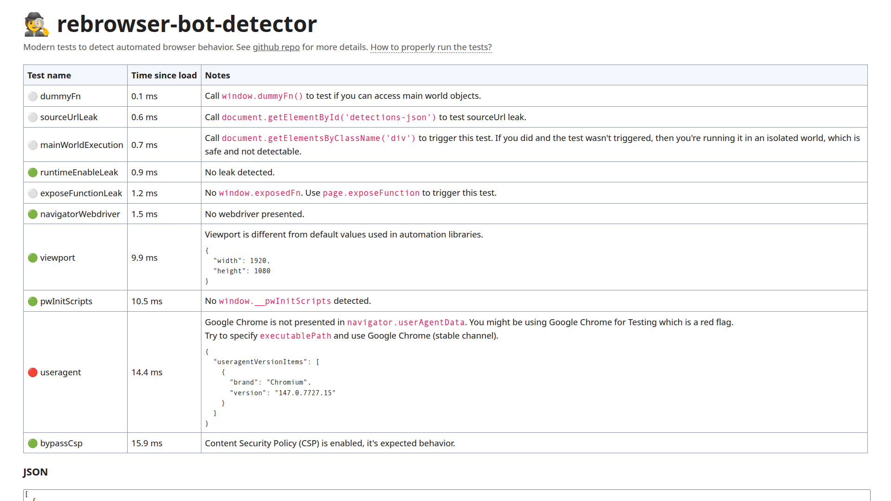 | 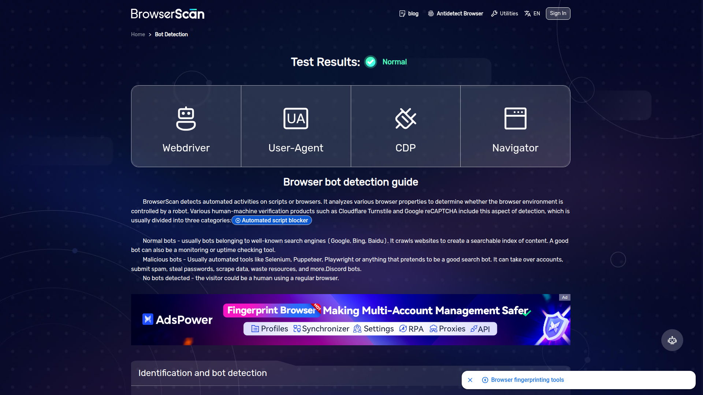 | 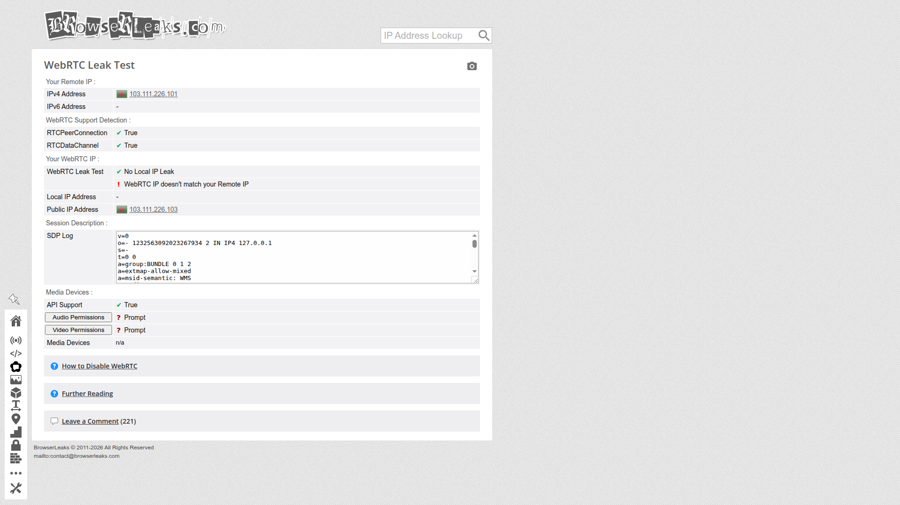 |

</details>

### Tested Against Real Anti-Bot Systems

These are the systems that block 99% of automation tools. BrowserPilot loaded **11 out of 14**:

| Site | Anti-Bot | Result |
|------|----------|--------|
| Foot Locker | DataDome (Tier S) | **Loaded** |
| Leboncoin | DataDome (Tier S) | **Loaded** |
| Vinted | DataDome (Tier S) | **Loaded** |
| Booking.com | DataDome + custom (Tier S) | **Loaded** |
| Nike | Akamai (Tier A) | **Loaded** |
| New Balance | Akamai (Tier A) | **Loaded** |
| Zalando | Akamai (Tier A) | **Loaded** |
| Wayfair | PerimeterX (Tier A) | **Loaded** |
| Ticketmaster | Multiple (Tier A) | **Loaded** |
| Stake.com | Cloudflare Enterprise | **Loaded** |
| LinkedIn | Cloudflare + custom | **Loaded** |

<details>
<summary><b>See anti-bot bypass screenshots</b></summary>

| Foot Locker (DataDome) | Leboncoin (DataDome) | Vinted (DataDome) |
|---|---|---|
| 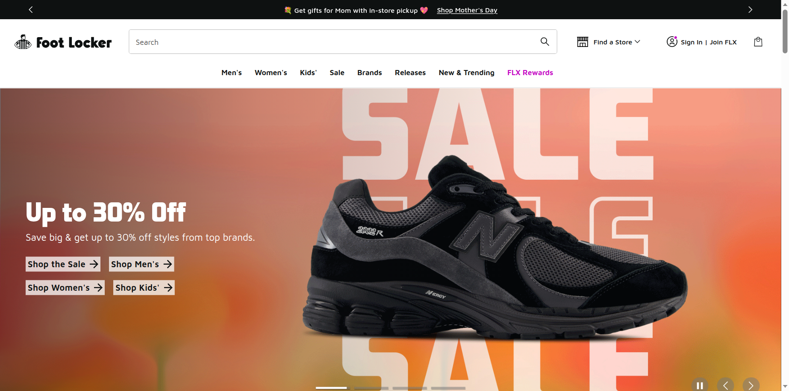 | 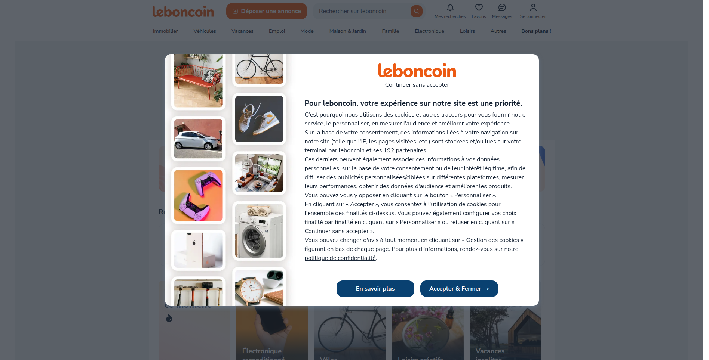 | 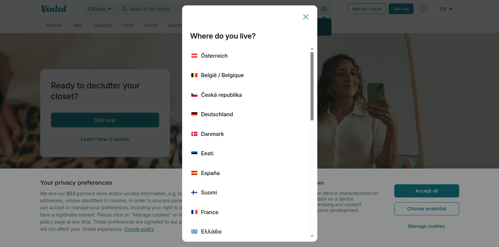 |

| Nike (Akamai) | Wayfair (PerimeterX) | Ticketmaster |
|---|---|---|
| 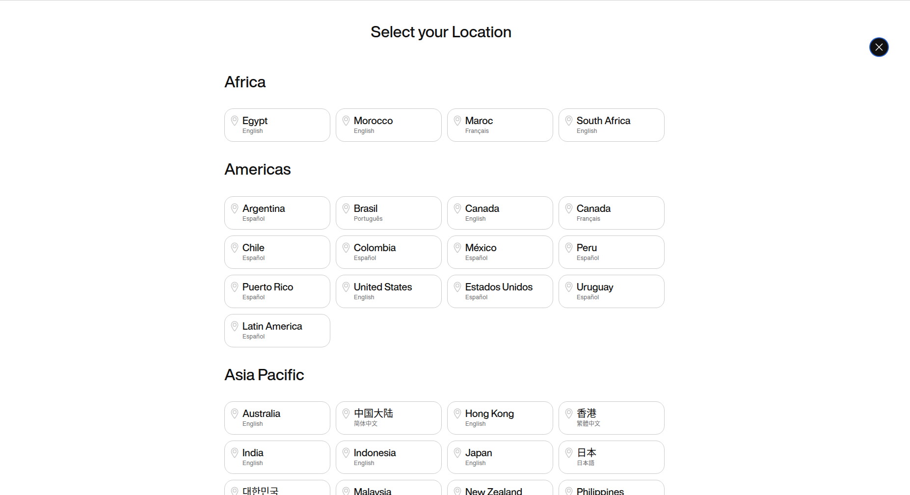 | 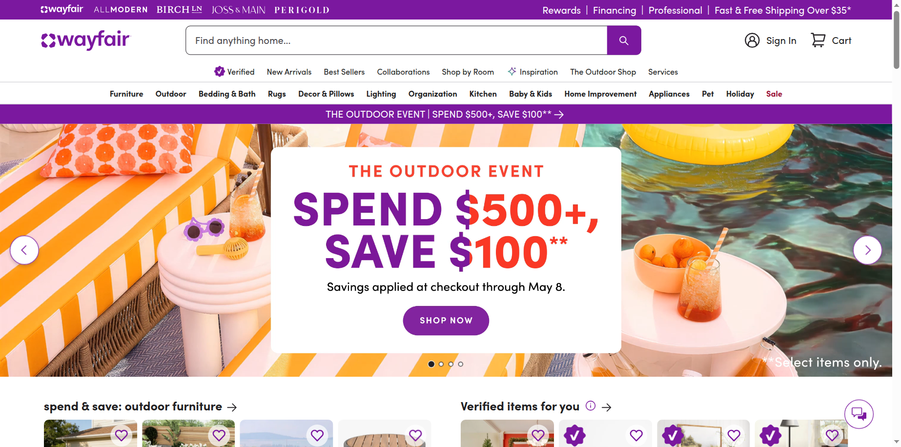 | 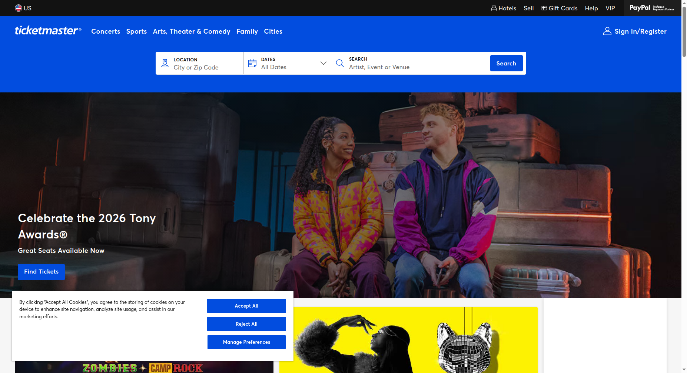 |

| New Balance (Akamai) | Stake.com (CF Enterprise) | Booking.com |
|---|---|---|
| 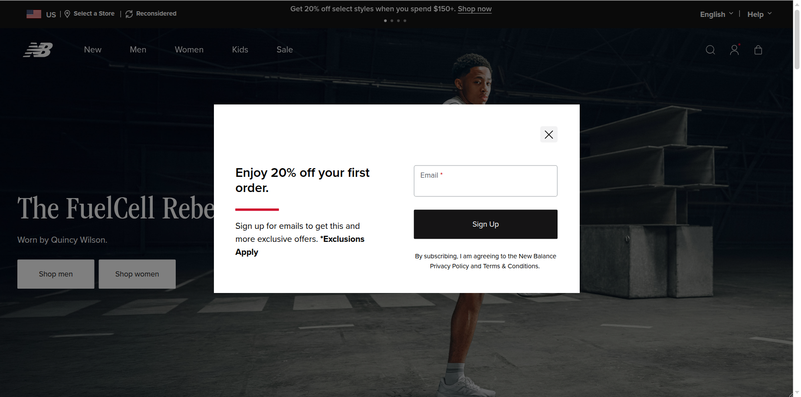 | 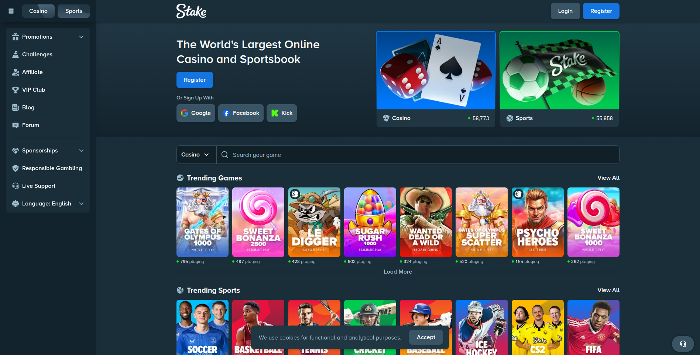 | 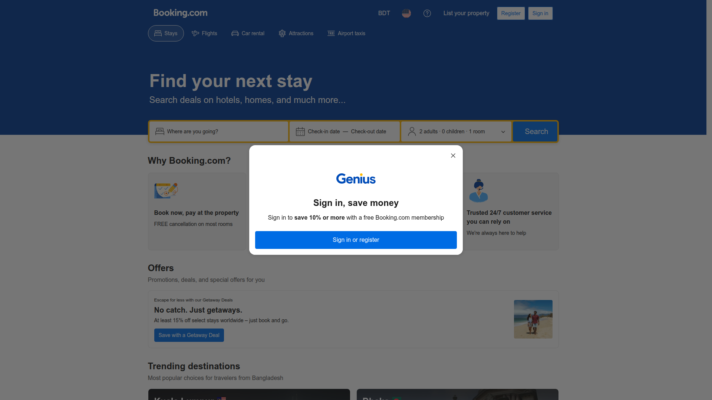 |

</details>

### How the stealth works

- **Patchright** — Playwright fork that never calls `Runtime.enable` (defeats CDP detection)
- **Full Chromium + xvfb** — real browser window, real GPU, real WebGL fingerprints
- **Fingerprint rotation** — each session gets a unique viewport, UA, DPR, locale, timezone
- **Human behavior** — Bezier mouse curves, variable typing speed, natural scroll patterns
- **Geo-matching** — proxy country auto-maps to correct timezone + locale
- **WebRTC blocked** — local IP never leaks

> No noise injection. Anti-bots detect canvas/WebGL noise by rendering known values. Real fingerprints from real hardware, varied through configuration, is stronger.

---

## Bulk Scraping at Production Scale

Not a demo — a production bulk engine that scrapes hundreds of pages concurrently without getting blocked.

<p align="center">
  
</p>

| Feature | How |
|---------|-----|
| **10 parallel workers** | Each with unique fingerprints |
| **Context rotation** | New identity every N pages, no browser restart |
| **Resource blocking** | Skip images/fonts/CSS — 3-5x faster |
| **Adaptive throttle** | Backs off on 429s, speeds up on success |
| **Checkpoint/resume** | Crash? Resume from where you stopped |
| **Shared intelligence** | One worker blocked = all workers skip that combo |

```bash
# Start a bulk job
curl -X POST http://localhost:8000/bulk \
  -H "Content-Type: application/json" \
  -d '{
    "urls": ["https://site1.com/page1", "https://site2.com/page2", "..."],
    "prompt": "Extract product names and prices",
    "format": "json",
    "max_workers": 5,
    "block_resources": true
  }'

# Check progress
curl http://localhost:8000/bulk/{job_id}

# Resume after crash
curl -X POST http://localhost:8000/bulk/{job_id}/resume
```

| Benchmark | Pages | Speed | Blocked |
|-----------|-------|-------|---------|
| Hacker News | 15/15 | **37.8 pages/min** | 0 |
| DataDome + Akamai + PerimeterX + Cloudflare | 10/10 | **33.7 pages/min** | 0 |

---

## Quick Start

### Docker (recommended)

```bash
git clone https://github.com/ai-naymul/BrowserPilot.git
cd BrowserPilot
echo 'GOOGLE_API_KEY=your_key_here' > .env
docker-compose up -d
```

Open `http://localhost:8000` — done.

### Manual

```bash
git clone https://github.com/ai-naymul/BrowserPilot.git && cd BrowserPilot
pip install -r requirements.txt
echo 'GOOGLE_API_KEY=your_key_here' > .env
python -m uvicorn backend.main:app --reload
```

### Configuration

```bash
# Required
GOOGLE_API_KEY=your_gemini_api_key

# Optional — proxies for heavy scraping
SCRAPER_PROXIES=[{"server": "http://proxy:port", "username": "user", "password": "pass", "location": "US"}]
```

---

## Use Cases

**Price monitoring** — Track competitor pricing across Amazon, Walmart, Best Buy. Get structured JSON, schedule with cron.

**Lead generation** — Extract company data from LinkedIn, G2, Crunchbase. BrowserPilot handles login walls and infinite scroll.

**Real estate data** — Pull listings from Zillow, Realtor.com, Redfin. Export as CSV for analysis.

**Market research** — Monitor product launches on Product Hunt, reviews on Trustpilot, job postings on Indeed.

**Academic research** — Collect data from government portals, research databases, news sites that block standard scrapers.

---

## How It Works

```
You type: "Extract laptop prices from Best Buy"
    |
    v
AI Vision (Gemini 2.5 Flash) sees the page like you do
    |
    v
Decides: click search, type query, scroll, extract data
    |
    v
Ghost Mode stealth keeps it undetected
    |
    v
Structured output: JSON / CSV / PDF / whatever you asked for
```

The AI doesn't rely on CSS selectors or DOM structure — it looks at a screenshot and decides what to do. When a site redesigns, BrowserPilot doesn't break.

---

## Roadmap

| Version | What | Status |
|---------|------|--------|
| v1.0 | Foundation — tests, CI, Docker, community | Done |
| v1.1 | Ghost Mode — stealth, bulk scraping, human behavior | **Done** |
| v1.2 | Universal Proxy — SOCKS4/5, file input, geo-routing | Next |
| v1.3 | Crawl Anything — pagination, sitemaps, full-site crawl | Planned |
| v2.0 | Generative UI — natural language to live visual dashboards | Planned |

---

## Contributing

PRs welcome. [Read the contributing guide](CONTRIBUTING.md) or just:

1. Fork it
2. Create a branch (`git checkout -b my-feature`)
3. Make changes + add tests
4. Open a PR

## Acknowledgments

[Patchright](https://github.com/nicecatchpro/patchright) | [Playwright](https://playwright.dev/) | [Google Gemini](https://ai.google.dev/) | [FastAPI](https://fastapi.tiangolo.com/)

---

<p align="center">
  <b>If BrowserPilot saves you time, drop a star. It helps more people find it.</b>
</p>
